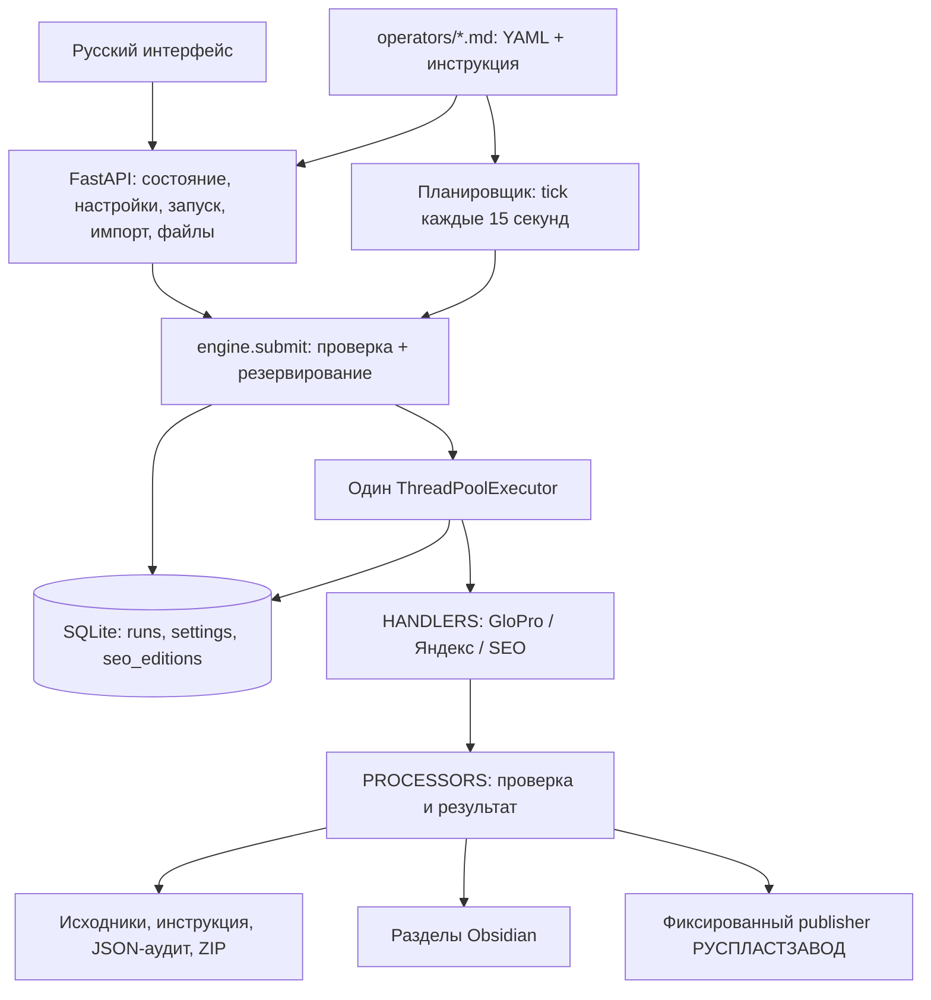

# Развитие «Артель Оператор» — аудит, референсы и первый этап

Дата проверки: **24 сентября 2026**. Исходный commit: `08159fe85fb7a0e49e47c9c56bfef3a6c88214ce`; рабочее дерево до начала было чистым. Основной референс — **Prefect**, как источник решений для управления состояниями выполнения. Текущий стек и специализированные обработчики сохраняются. Подключение Prefect как зависимости не требуется.

## 1. Что проверено

Прочитаны код приложения, конфигурация трёх операторов, зависимости, запуск через macOS/Docker, существующие тесты и эксплуатационные отчёты. Для SEO также проверены интерфейсы вызываемых скриптов соседнего `rusplast-zavod`: `scripts/editorial-context.mjs`, `scripts/publish-article.py`, `cms/scripts/publish-article.cjs`.

| Проверка | Результат и граница доказательства |
|---|---|
| Исходный `.venv/bin/python -m pytest -q` | 296 passed, 3 skipped, 54 subtests passed. Два предупреждения устаревающих интерфейсов зависимостей. |
| Отдельный исходный браузерный прогон | 3 passed: GloPro/Яндекс на локальных имитациях, без доступа к реальным кабинетам. |
| Работающий `http://127.0.0.1:8790/` | HTTP 200 и ожидаемая страница. Проверка доступности уже запущенного сервиса, не нового кода и не завершённого задания. |
| История SQLite, соединение `mode=ro` | GloPro: 4 completed, 12 failed, 1 needs_review; Яндекс: 6 completed, 7 failed; SEO: 3 completed, 1 failed. Это сохранённые статусы, не независимое доказательство корректности всех файлов/публикаций. |
| Живые интеграции | Новые выгрузки GloPro/Яндекс, AI-генерация и CMS-публикация в этом исследовании не запускались. Результаты 22–23 сентября описаны в существующих verification-документах; текущую авторизацию и доступность они не гарантируют. |

`docs/platforms.md` описывает состояние на 19 сентября. Его утверждение о неподтверждённой полной выгрузке нельзя переносить на текущую версию: после него появились код и отчёты 22 сентября. В том документе добавлена ссылка на этот аудит, исходные исторические записи сохранены.

## 2. Существующая архитектура и функции

Стек: Python 3.12+, FastAPI 0.141.1, Uvicorn 0.53.0, PyYAML 6.0.3, openpyxl 3.1.5, Playwright 1.63.0, python-multipart 0.0.32; SQLite из стандартной библиотеки. UI — статические HTML/CSS/JavaScript, без отдельной сборки. Версии зафиксированы в `requirements.txt`; pytest 9.1.1 и httpx 0.28.1 — в dev-зависимостях.



Схема отражает текущее приложение с усиленной границей `submit`; новые серверы и очереди не добавлены. Для топлива поток — кабинет или импорт → исходный XLSX → детерминированная сверка → отчёт/Obsidian → аудит и архив. Для SEO — свежий CMS-контекст → Codex-автор → отдельная проверка текста → imagegen и проверка картинки → сохранение подготовленного выпуска → внешний publisher → проверка публикации.

| Компонент / сценарий | Реальное состояние | Основание и что сохранять |
|---|---|---|
| UI и локальный HTTP API | Реализованы; API покрыт тестами | `main.py`, `static/app.js`, `tests/test_api.py`: состояние, редактирование Markdown, создание оператора, запуск, импорт и скачивание разрешённых файлов. UI не подвергался полному ручному обходу. |
| Расписание и история | Реализованы в одном процессе | `config.py`, `engine.tick`, `storage.py`: Москва, плановая дата, догоняющие топливные запуски за последние 7 дней, уникальный индекс schedule. После перезапуска прерванные queued/running становятся failed с ручным повтором. |
| GloPro | Реализован адаптер и проверяемый расчёт | `glopro.py`, `calculator.py`, `weekly.py`, `process_glopro`: полная пагинация фирм, договоры, происхождение нового XLSX, Decimal, возвраты, сверка периода и итогов. |
| Недельные Китай / НК АРТЭЛЬ | Реализованы отдельные правила | Только вторник; свой период и формулы. Для обычных фирм сохраняются вторник/пятница и обычные коэффициенты. Подробные регрессии в `test_weekly*.py`. |
| Яндекс Заправки | Реализован кабинетный адаптер и импорт | `yandex_connection.py`, `yandex_cabinet.py`, `yandex.py`, `yandex_reports.py`: локальная сессия, все заказы недели, пагинация, идентичность по user_id, построчная сверка XLSX и повторная выборка недели. |
| Комплект файлов и Obsidian | Реализованы | `engine.execute`, `publication.py`, `yandex_publication.py`: исходники, снимок инструкции, SHA, JSON, ZIP, замена адресованных разделов. Найденный дефект ручных разделов GloPro исправлен ниже. |
| SEO с AI | Реализован, unit-тесты проходят | `seo.py`: отдельные вызовы Codex для автора/reviewer/imagegen/image review; durable-состояния reviewed/prepared/published. AI используется именно здесь; топливные суммы не поручены модели. |
| Сохранение выпуска и повтор | Реализованы | `seo_editions`, `manual:<edition_key>`, SHA текста/PNG, reuse и verify-existing; publisher в соседнем репозитории дополнительно проверяет CMS. Уже опубликованный выпуск повторно не генерируется. |
| Произвольные операторы из Markdown | Частичная расширяемость | Реестр HANDLERS/PROCESSORS существует, новый тип требует Python-адаптера, правил периода и подключения. Свободный Markdown сам действия не исполняет. |
| Контроль фактов SEO | Частично детерминирован, частично AI | Проверяются выдержки, структура, ссылки, повтор темы; автор/reviewer — отдельные вызовы одного Codex, не независимые эксперты. Содержимое PDF не разбирается, передаются метаданные. |
| Лукойл | Только шаблон | Правила описаны, автоматического коннектора нет. |
| Постоянный сервер | Подготовлен Docker-вариант, развёртывание не подтверждено | Compose и Dockerfile присутствуют. SEO требует соседнего checkout, Node/Codex/SSH и локальных абсолютных путей — обычный образ сам этого не обеспечивает. |
| Аналитика SEO-эффекта | Не реализована в исследованном коде | GSC/GA4, измерение поискового спроса и роста трафика отсутствуют. Наличие генерации не доказывает улучшения ранжирования. |

Telegram отменён ранее и отсутствует в текущем продукте; возвращать его не требуется. Управление лимитами карт, рассылка и электронная подпись также не входят в реализованные сценарии.

### Контракты, которые необходимо сохранить

1. Имена/методы HTTP API, структура RunBody, статусы queued/running/completed/failed/needs_review/no_data, правило одного активного задания, история и адреса файлов.
2. YAML-настройки, enabled, ручной запуск выключенного встроенного оператора, формулы Decimal, округления, периоды и исключения клиентов.
3. «Неизвестно» не превращается в «операций нет»; неполный комплект не публикует активацию; старый XLSX не подставляется вместо нового.
4. Разделение сотрудников по user_id; импорт отдельных файлов не объявляется полной сверкой кабинета; отсутствие автора в справочнике не исключает его заправки.
5. Имена файлов, содержимое отчётов, аудитов и ZIP; ручной текст и чужие разделы Obsidian; устойчивость повтора без копий с суффиксом.
6. SEO edition_key, исходный текст/PNG, стадии, ручные изменения редактора, отсутствие пачки пропущенных публикаций; JSON и receipt контракты внешнего publisher.
7. Только localhost/SSH-туннель, проверки Origin/Host, отсутствие паролей в API, права на data, исключение runtime-файлов из Git.

### Ограничения и риски

- Поддерживается **один процесс приложения**. `storage.init()` завершает все активные записи как прерванные; транзакция резервирования сама по себе не делает приложение многопроцессным. `--workers 1` остаётся обязательным.
- Выключенный/спящий Mac не выполняет расписание. Авторизация порталов, Codex и SSH может истечь; браузерные селекторы зависят от поставщиков.
- SQLite и локальные файлы не образуют общую транзакцию с Obsidian или CMS. Ошибка сборки архива после публикации не означает, что внешнего действия не было. Ручной повтор SEO должен сохранять тот же edition_key и verify-existing.
- Markdown разбирается по соглашениям проекта, а не полноценным Markdown AST. Исправление ниже сохраняет разделы `#`/`##`; произвольный текст внутри управляемого `###` остаётся частью заменяемого блока компании.
- Writer Obsidian использует общий временный путь и не обнаруживает внешнее редактирование между чтением и replace; это остаётся отдельной задачей.
- `_generate` проверяет JSON parsing и полагается на CLI output-schema, но локально не валидирует все типы. Некорректный ответ может дать TypeError/AttributeError. Две одинаковые evidence-строки сейчас удовлетворяют количественному порогу; изменение этого порога было бы изменением редакционной политики.
- Один повреждённый Markdown может сорвать `load_operators()` для всей коллекции. Обобщать обработку этой ошибки следует отдельно, сохранив понятное состояние каждого оператора.
- SEO зависит от версии скриптов соседнего checkout. Unit-тесты заменяют внешний publisher; межрепозиторный контракт требует отдельного проверочного набора.
- Полный отказ диска/БД нельзя исправить записью failed в ту же недоступную БД. Сохраняется существующее восстановление после перезапуска; автоматический replay внешних действий не добавлен.

## 3. Референсы GitHub

Выбор сделан после чтения проекта. Для проверки поддержки использованы GitHub API, история commit/release, обсуждения issues и конкретные исходные файлы. Звёзды не использовались как критерий. Даты и состояния ниже — снимок на 24.09.2026.

| Референс | Архитектура и стек | Лицензия | Вывод для проекта |
|---|---|---|---|
| [Prefect](https://github.com/PrefectHQ/prefect) — основной | Python flow/task engine, состояния, API/server, workers; FastAPI, Pydantic, SQLAlchemy, SQLite/PostgreSQL | [Apache-2.0](https://github.com/PrefectHQ/prefect/blob/148e99781fb05df258d3efddb5ef4fee0b61c9f2/LICENSE) | Наиболее близок к текущей проблеме надёжности исполнения. Переносим принципы транзакций и завершения ошибок; не устанавливаем весь runtime. |
| [APScheduler](https://github.com/agronholm/apscheduler) | Python scheduler: triggers, job stores, executors; sync/async интеграция. В стабильной 3.x и разрабатываемой 4.x разные архитектуры | [MIT](https://github.com/agronholm/apscheduler/blob/3.11.3/LICENSE.txt) | Полезен для ограничений параллелизма и тестов времени. Замена текущего tick сейчас не нужна. |
| [LangGraph](https://github.com/langchain-ai/langgraph) | Python state graph/Pregel runtime; langchain-core, Pydantic, отдельные checkpoint savers, в том числе SQLite | MIT: [ядро](https://github.com/langchain-ai/langgraph/blob/7daa3ab49d678a5da75edb08baa87db4a2be52c3/libs/langgraph/LICENSE), [SQLite saver](https://github.com/langchain-ai/langgraph/blob/7daa3ab49d678a5da75edb08baa87db4a2be52c3/libs/checkpoint-sqlite/LICENSE) | Дополнительный референс восстановления SEO по стадиям. Нынешний линейный pipeline уже имеет нужные checkpoints; графовый runtime не оправдан. |

### Prefect: что прочитано и почему выбран

Зафиксирован commit [`148e9978`](https://github.com/PrefectHQ/prefect/commit/148e99781fb05df258d3efddb5ef4fee0b61c9f2), 22.09.2026. `SecureFlowConcurrencySlots` резервирует выполнение до перехода к запуску и имеет cleanup; `ReleaseFlowConcurrencySlots` освобождает ресурс при выходе из активных состояний. Это прямое основание для пары «резерв в SQLite → submit → терминальная ошибка при отказе». [Исходный core_policy.py](https://github.com/PrefectHQ/prefect/blob/148e99781fb05df258d3efddb5ef4fee0b61c9f2/src/prefect/server/orchestration/core_policy.py#L559).

Условный SQL UPDATE в [`concurrency_limits_v2.py`](https://github.com/PrefectHQ/prefect/blob/148e99781fb05df258d3efddb5ef4fee0b61c9f2/src/prefect/server/models/concurrency_limits_v2.py#L254) объединяет проверку свободной ёмкости и её захват. Artel использует эквивалентный по цели приём для своего sqlite3: BEGIN IMMEDIATE, SELECT активных записей, INSERT в одной короткой транзакции. Это адаптация идеи, не копия SQLAlchemy-кода.

Поддержка активна: стабильный [3.8.6 от 14.09.2026](https://github.com/PrefectHQ/prefect/releases/tag/3.8.6), dev-релизы 23 сентября. [Issue #23051](https://github.com/PrefectHQ/prefect/issues/23051), открытый 7 сентября, закрыт 11 сентября после [PR #23052](https://github.com/PrefectHQ/prefect/pull/23052), одобренного и влитого maintainer. Этот PR использует BEGIN IMMEDIATE до чтения для устранения SQLite lock errors. При этом [#18894 о дублировании расписаний](https://github.com/PrefectHQ/prefect/issues/18894) остаётся открытым: установка фреймворка не заменяет прикладную идемпотентность.

Полное внедрение означало бы новые состояния, deployment/worker abstractions, зависимости и хранение. Для текущего последовательного локального приложения перенос конкретного принципа дешевле и проверяемее; расчётам и портал-адаптерам Prefect ничего необходимого сейчас не добавляет.

### APScheduler: полезный компонентный референс

В стабильном [`executors/base.py`](https://github.com/agronholm/apscheduler/blob/3.11.3/src/apscheduler/executors/base.py#L58) submit защищён lock, количество активных экземпляров увеличивается после успешной передачи; `_run_job_error` освобождает счётчик. Используем принцип учёта ресурса и при неудаче. В [`SQLAlchemyDataStore.acquire_jobs`](https://github.com/agronholm/apscheduler/blob/81e9fdcaac8d6c72f4318cb7ff393c913c7f9440/src/apscheduler/datastores/sqlalchemy.py#L871) ветки 4.x захват ограничен транзакцией; это исследовательский пример, а не рекомендованная зависимость.

Поддержка подтверждена [релизом 3.11.3 от 28.06.2026](https://github.com/agronholm/apscheduler/releases/tag/3.11.3), [commit от 20.09.2026](https://github.com/agronholm/apscheduler/commit/81e9fdcaac8d6c72f4318cb7ff393c913c7f9440) и работой автора в [#1021](https://github.com/agronholm/apscheduler/issues/1021). В issue автор обсуждает воспроизведение и исправления; issue формально открыт, хотя история релизов описывает исправления DST. В [README зафиксированной master-версии](https://github.com/agronholm/apscheduler/blob/81e9fdcaac8d6c72f4318cb7ff393c913c7f9440/README.rst) 4.x явно обозначена как pre-release с возможными несовместимыми изменениями.

Сейчас замена tick принесла бы миграцию schedule job store и необходимость воспроизвести особые периоды, catch-up и SEO-slot. Сохраняем существующий механизм; обратиться к стабильной библиотеке имеет смысл при реально появившейся потребности в более сложных календарях.

### LangGraph: восстановление AI-этапов

В [`SqliteSaver.put/put_writes`](https://github.com/langchain-ai/langgraph/blob/7daa3ab49d678a5da75edb08baa87db4a2be52c3/libs/checkpoint-sqlite/langgraph/checkpoint/sqlite/__init__.py#L387) результаты сохраняются по устойчивым составным ключам; [`pregel/_loop.py`](https://github.com/langchain-ai/langgraph/blob/7daa3ab49d678a5da75edb08baa87db4a2be52c3/libs/langgraph/langgraph/pregel/_loop.py#L1530) упорядочивает записи checkpoint. Полезно развивать существующие seo_editions: привязывать сохранённый этап к выпуску и отпечатку входа, фиксировать результат до перехода дальше.

Поддержка активна: [ядро 1.2.12 от 21.09.2026](https://github.com/langchain-ai/langgraph/releases/tag/1.2.12), [commit от 23.09.2026](https://github.com/langchain-ai/langgraph/commit/7daa3ab49d678a5da75edb08baa87db4a2be52c3); [#8616](https://github.com/langchain-ai/langgraph/issues/8616) закрыт через [PR #8617](https://github.com/langchain-ai/langgraph/pull/8617) 28 августа после открытия 13 августа. В monorepo более свежий CLI-релиз не равен релизу ядра. [#8796](https://github.com/langchain-ai/langgraph/issues/8796) остаётся открытым и обсуждает владение записью при нескольких исполнителях; его утверждения здесь не воспроизводились.

Checkpoints не образуют транзакцию с CMS. Даже при внедрении LangGraph остаются обязательными устойчивый edition_key, проверка существующей публикации и запрет повторной генерации после её успеха. Универсальный graph runtime, новые агенты и автоматические retry сейчас не нужны.

### Лицензии и заимствование

В текущей доработке **чужой код не скопирован**, зависимости не добавлены. Лицензии проверены для конкретных изученных файлов/пакетов. При будущем переносе фрагментов потребуется сохранить применимые copyright/лицензионные уведомления; лицензии hosted/enterprise-продуктов не выводятся из лицензии открытого ядра. В репозитории Artel нет собственного LICENSE; не следует автоматически считать весь проект открытым для распространения.

## 4. Внесённая адаптация

| Проблема | Изменение и переиспользование | Референс / совместимость | Риск и регрессия |
|---|---|---|---|
| Проверка занятости читала лишь последние 100 запусков; read/insert были раздельны | `storage.create_run(..., require_idle=True)` проверяет все активные записи и создаёт запуск одной транзакцией BEGIN IMMEDIATE. Таблица, payload, timeout SQLite и уникальный scheduled_once сохранены | Prefect conditional reservation + PR #23052; реализовано стандартным sqlite3 | Короткая write-блокировка. Тест двух параллельных соединений и queued/running за пределами страницы истории. Это не поддержка нескольких процессов приложения. |
| edition_key сохранялся отдельным UPDATE после создания | Идентичность внепланового выпуска записывается вместе с первоначальным payload | Prefect: данные резервирования сохраняются до dispatch; существующий контракт SEO | Те же поля/значения, без миграции. Проверены запись identity и существующие SEO-тесты. |
| Отказ POOL.submit оставлял вечный queued | `engine.submit` фиксирует failed и finished_at, сохраняет безопасное сообщение и пробрасывает исходную ошибку вызывающему коду | Prefect cleanup, APScheduler учёт отказа dispatch | HTTP-контракт не переопределён; ручной повтор снова разрешён. Scheduled-запись не удаляется и автоматически не повторяется. |
| mkdir до try и ошибка чтения файлов в finally оставляли незавершённый запуск | Начальная подготовка включена в защищённое выполнение; OSError при финальной инвентаризации фиксируется как failed, временные импортированные файлы очищаются | Prefect terminal-state/release principle | При нечитабельном артефакте список скачиваний пуст, файлы на диске не удаляются. Внешняя публикация могла уже произойти; автоматического повтора нет. Тесты обоих отказов. |
| Обновление последней компании удаляло следующий ручной `#`/`##` раздел | `publication._sections` учитывает родительские заголовки; сортировка ограничена непрерывной группой компаний | Внешний framework для этого не нужен; адаптирован принцип границ уже имеющегося `yandex_publication.sections` | Обычный плоский отчёт сортируется как прежде; вложенный `####` остаётся частью компании. Проверены текст, соседние фирмы, положение разделов и повтор. |

Это изменения ошибочных случаев в рамках уже заявленных контрактов. Расчётные модули, коннекторы, SEO generation/publisher, HTTP-маршруты, frontend, конфигурации операторов и форматы данных не изменены. Существующие записи БД не переписывались, DDL/миграций нет.

## 5. Следующие небольшие этапы

Ближайшая рабочая версия ограничена надёжной постановкой/завершением текущих заданий и сохранением пользовательского текста. Она реализована в данном изменении. Остальные строки — план развития, не утверждение о выполнении и не основание менять совместимость.

| Этап / компоненты | Результат и критерий готовности | Проверки / риск / откат |
|---|---|---|
| 0. Исходное поведение — выполнено | Чистый исходный commit, полный baseline, локальные browser fixtures, read-only проверка истории | Сохранён исходный SHA и команды. Живые интеграции отделены от тестов. |
| 1. Lifecycle — выполнено: storage.py, engine.py | Один резерв, терминальная запись при отказе dispatch и файловой операции; прежние API и schedule semantics | 7 новых тестовых случаев; все прежние engine/SEO/schedule/API тесты. Откат только этих файлов, схема БД совместима. |
| 2. Сохранение заметки — выполнено: publication.py | Ручные `#`/`##`, соседние фирмы и положение групп не теряются; повтор идемпотентен | 4 новых случая + прежние output/weekly тесты. Откат кода не восстанавливает уже изменённую внешнюю заметку: перед реальным применением важна её файловая история/копия. |
| 3. Граница результата AI — следующий приоритет: seo.py | Локальная проверка типов существующей schema; повреждённый JSON даёт понятную ошибку до publisher, валидный выпуск проходит как раньше | Неверные object/list/string, неполный результат, запрет publish при ошибке, golden-валидный draft. Референс Prefect typed states/schema; переиспользовать текущие DRAFT/REVIEW schemas. Не ужесточать evidence-policy в той же правке. Откат одного модуля/тестов без миграции. |
| 4. Межрепозиторный SEO-контракт — после этапа 3 | Набор сохранённых обезличенных входов/receipt; fault injection на reviewed, prepared, publish-success-before-checkpoint; повтор использует существующую публикацию | Референс LangGraph стабильных checkpoint keys. Сохранить seo_editions и verify-existing; сначала тесты вокруг существующего кода. Любые дополнительные поля вводить опционально с чтением старых записей; смена schema — отдельная согласованная миграция. |
| 5. Конфликт записи Obsidian — отдельный этап: оба publication writer | Уникальный temp и обнаружение изменения файла между чтением и записью; конфликт не затирает пользовательскую правку | Существующие merge-функции переиспользуются. Тест конкурирующего редактирования/ошибки replace/повтора. Общая идея явного владения записью согласуется с checkpoint stores, но нужна файловая реализация, не копия LangGraph. Новую видимую реакцию на конфликт согласовать перед выпуском; откат кода и восстановление заметки из копии раздельны. |

Новые коннекторы, автоматический retry внешних действий, multiworker, очередь Redis, перенос на PostgreSQL и смена UI-стека в ближайшую версию не входят: текущие требования не оправдывают их стоимость. Если появится задача работать при выключенном Mac, сначала нужен план размещения существующего приложения и его внешних зависимостей; это не требует предварительного переписывания на другой framework.

### Совместимость и откат

Первый этап не требует согласования миграции: нет удаления функций, смены API, настроек, формул или форматов. Добавлены keyword-only параметры внутренней функции storage, прежние вызовы сохранены. Ошибочные операции получают уже существующий failed; обычные успешные результаты остаются прежними.

Для отката завершить активное задание, сохранить текущий diff отдельно, вернуть **только** затронутые runtime-файлы из исходного commit и перезапустить единственный процесс. Не выполнять общий reset и не удалять data/work. Возвращать БД на старую копию не требуется. Перед будущими DDL-миграциями — SQLite backup API при остановленной записи, проверка чтения обеими версиями и отдельный обратный путь; перед изменением publisher — совместимый переход двух репозиториев.

Сервис на 8790 в этой работе не перезапускался: редактирование и тесты не доказывают, что уже работающий процесс загрузил новый Python-код. Для применения нужен обычный перезапуск после завершения текущего задания. Реальные порталы, Obsidian-заметки и CMS при проверках не изменялись.

## 6. Итог проверки первого этапа

Новые lifecycle-тесты до правки: **7 failed** (включая два теста ещё не добавленного интерфейса резервирования). Новые тесты границ заметки до правки: **3 failed, 1 passed**. Это фиксирует воспроизведение проблем, а не только тесты написанной реализации.

После правок:

```sh
RUN_BROWSER_TESTS=1 .venv/bin/python -m pytest -q
# 310 passed, 54 subtests passed, 2 warnings; 4.51 s
git diff --check
# успешно
```

Все 299 прежних случаев, включая три браузерных, и 11 новых прошли. Предупреждения касаются существующих deprecated-интерфейсов TestClient/httpx и AnyIO; они были и до правок. Версии зависимостей не менялись. Проверки выполняются на временных данных и локальных browser fixtures, не запускают реальные публикации.

## 7. Применение к локальной службе — 24.09.2026

Обновление применено в `/Users/mustafa/Desktop/artel-operator` в 14:51 МСК. Все восемь подготовленных файлов, включая новые тесты и этот аудит, перед применением совпадали с worktree. Повторный полный прогон: **310 passed, 54 subtests passed**, два прежних предупреждения.

Перед перезапуском queued/running отсутствовали. Сделана резервная копия через SQLite backup API, сохранены diff, исходные runtime-файлы из HEAD и снимок состояния в `data/backups/update-20260924-145153/` (приватный каталог, вне Git). Старый PID 837 корректно завершён SIGTERM; существующий LaunchAgent `ru.artel.operator` поднял PID 13516 с `--workers 1` из рабочего checkout. Единственный listener — 127.0.0.1:8790. Логи подтверждают завершённый shutdown и успешный startup без ошибок.

После перезапуска побайтово на уровне сохранённых значений совпали все 34 записи истории и настройки SQLite; SHA файлов операторов и применённого кода не изменились. `/api/state` возвращает три оператора, прежнюю историю и `scheduler_error: null`; браузер показывает рабочий обзор, расписания и результаты. Штатное расписание сохранено. Новые реальные выгрузки, записи Obsidian и CMS-публикации для проверки не запускались. Git commit/push не выполнялись.

Для отката к предыдущему коду дождаться отсутствия активных заданий, восстановить только три файла из `previous-code/operator_app/` в каталоге указанной резервной копии и корректно перезапустить единственный процесс через существующий LaunchAgent. Возврат БД не требуется.
